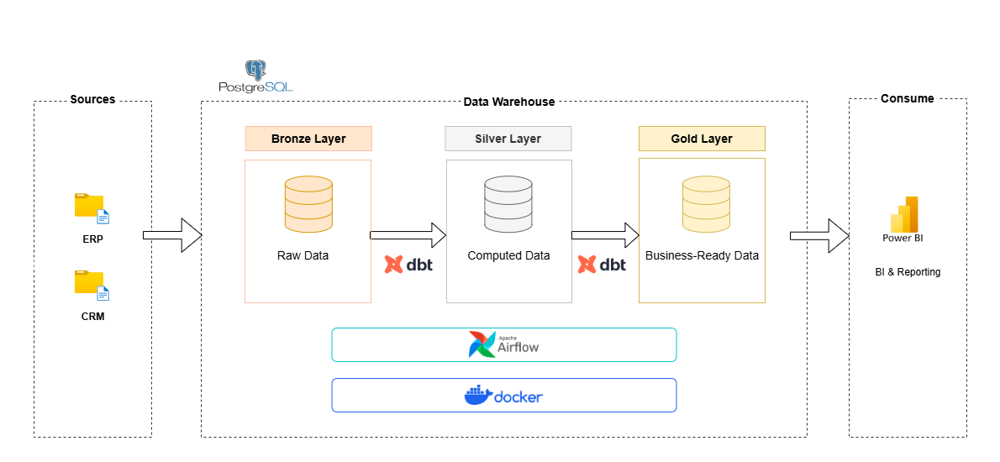
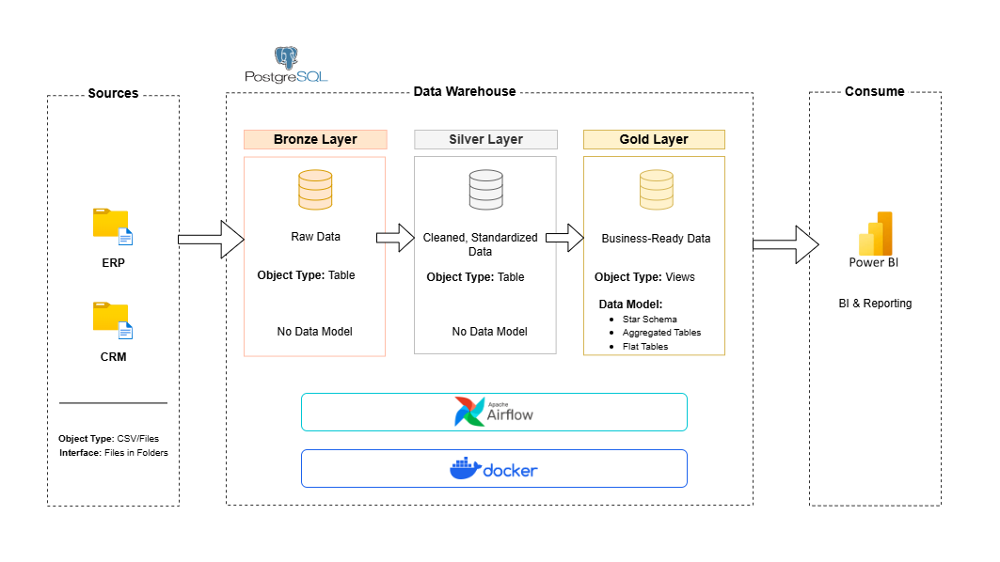
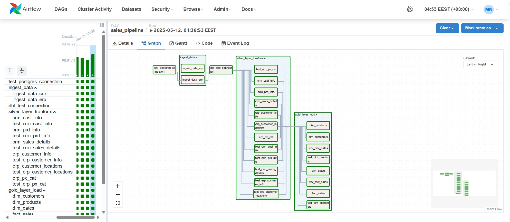
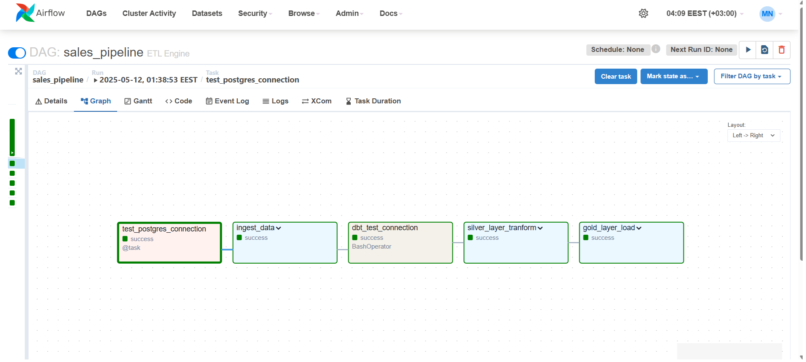
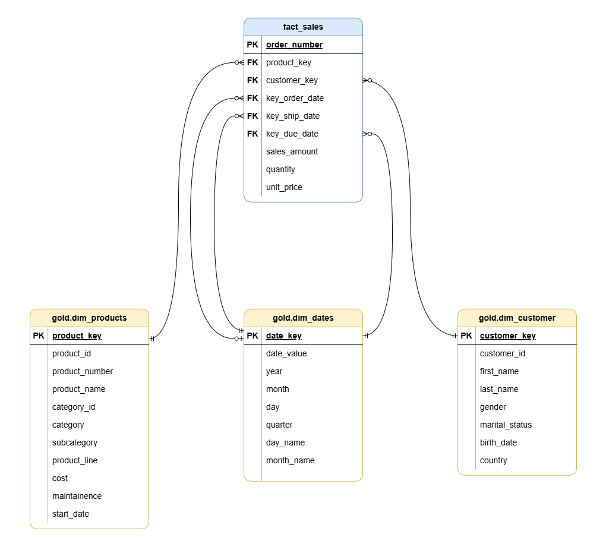
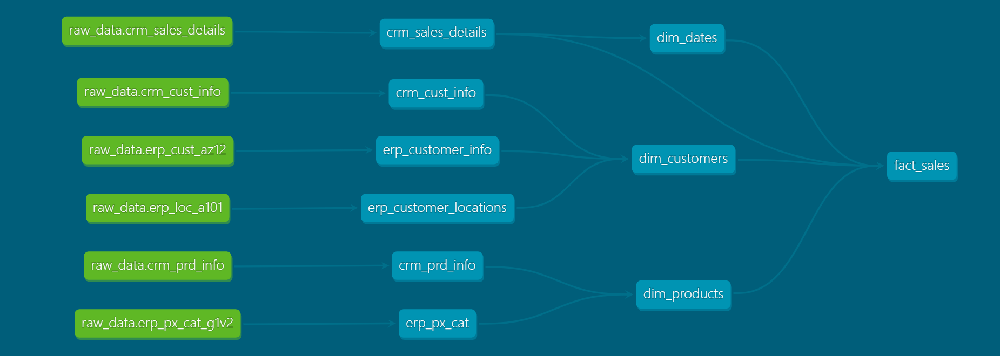

# ETL-engine


## 📑 Table of Contents
1. [Introduction](#introduction)  
2. [Used Technologies & Tools](#used-technologies--tools)  
3. [Data Lineage](#data-lineage)  
4. [Pipeline Architecture](#pipeline-architecture)  
5. [DBT Models Transformation](#dbt-models-transformation)  
6. [Data Catalog](#data-catalog)  
7. [Data Warehouse Data Modeling Schema](#data-warehouse-data-modeling-schema)  
8. [Reporting](#reporting)  

---

## 🧩 Introduction

This project utilizes data from two different sources (**CRM** and **ERP**), which provide detailed datasets about sales transactions, including customer information, products, locations, and more.  
These datasets are transformed and stored in a **Data Warehouse** using the **Medallion architecture** to structure the data efficiently for analytics.  
I applied **DBT (Data Build Tool)** in the ETL pipeline to transform raw data into analytics-ready datasets, ensuring high-quality and optimized data models for reporting and business intelligence.

---

## 🛠️ Used Technologies & Tools

- **Docker**: To containerize and standardize the development environment.  
- **Python**: For scripting tasks and automating data processes.  
- **PostgreSQL**: Acted as the data warehouse.
- **pgAdmin**: A graphical user interface to interact with the PostgreSQL database, inspect data, validate transformations, and execute SQL queries during development and testing.
- **Airflow**: Managed and scheduled ETL workflows.  
- **DBT (Data Build Tool)**: Handled the transformation and building of data models within the warehouse.  
- **Power BI**: Delivered the final insights through interactive dashboards and visual reports.  

---

## 🏗️ Pipeline Architecture


---

## Docker Setup 
To ensure consistency, reusability, and easy environment setup across all tools used in this project, I utilized Docker and Docker Compose to build a fully integrated ETL development environment.

### 🔧 Custom Dockerfile
A custom Docker image `engine-airflow-custom:latest` was created based on apache/airflow:2.10.4 to include all necessary libraries used in the ETL pipeline and DBT transformations:
```bash
FROM apache/airflow:2.10.4

USER airflow

RUN pip install --no-cache-dir \
    pandas \
    dbt-core \
    dbt-postgres \
    airflow-dbt-python \
    psycopg2-binary \ 
    flake8    

USER root
RUN apt-get update && apt-get install -y git

```
For detailed settings and the full configuration for `volumes`, `Networks`, and the working tools, please refer to the docker-compose.yml file in the repository here: 
[docker compose file](airflow/docker-compose.yml)

---

## 🏗️ DAG Overview

The ETL pipeline is orchestrated by Apache Airflow using the TaskFlow API and Bash Operators, with a focus on modular ingestion, transformation, and testing for CRM and ERP data sources.





### 🔧 DAG Overview: sales_pipeline
This DAG is responsible for extracting, transforming, and loading sales-related data into a PostgreSQL database, then applying DBT models to transform the data into clean dimensional layers.
See More: [Pipeline.py](airflow/dags/pipeline.py)

## 🔄 DBT Models Transformation

The transformation layer of this ETL pipeline is implemented using **DBT (Data Build Tool)** to structure and optimize raw data for analytics and reporting purposes. The transformation process follows a layered approach using the **Medallion Architecture**, specifically focusing on the **Silver** and **Gold** layers.

### 🪙 Silver Layer (Cleaned & Structured Data)

In the **Silver layer**, raw data from the **Bronze layer** (which consists of six tables sourced from CRM and ERP systems) is cleaned, standardized, and structured.

**Bronze Layer Tables:**
- `crm_cust_info`
- `crm_prd_info`  
- `crm_sales_details`
- `erp_cust_az12`
- `erp_loc_a101`
- `erp_px_cat_g1v2`       

**Transformed into Silver Layer Tables:**
- `crm_cust_info` *(retained with cleaning and standardization)*

``` bash
{{ 
    config(        
        materialized='table',
        unique_key='ID',
        indexes=[{"columns": ['ID'], "unique": true}],
    ) 
}}


with customer_info as (
    SELECT 
        *, 
        row_number() OVER (PARTITION BY cst_id ORDER BY cst_create_date DESC) AS last_update
    FROM {{ source('raw_data', 'crm_cust_info') }}
)

SELECT 
    cst_id AS ID,
    cst_key AS customer_key,
    TRIM(cst_firstname) as firstname,
    TRIM(cst_lastname) as lastname,
    CASE 
        WHEN UPPER(TRIM(cst_marital_status)) = 'S' THEN 'Single' 
        WHEN UPPER(TRIM(cst_marital_status)) = 'M' THEN 'Married' 
        ELSE  'N/A'
    END AS marital_status,
    CASE 
        WHEN UPPER(TRIM(cst_gndr)) = 'F' THEN 'Female' 
        WHEN UPPER(TRIM(cst_gndr)) = 'M' THEN 'Male' 
        ELSE  'N/A'
    END AS gender,
    cst_create_date
FROM customer_info
WHERE last_update = 1 and cst_id is not null
```
- `crm_prd_info` *(retained with cleaning and standardization)*
```bash
{{
    config(
        materialized='table',
        unique_key='product_id',
        indexes=[{"columns": ['product_id'], "unique": true}]
    )
}}

with products_info as (
    SELECT 
        *, 
        row_number() OVER (PARTITION BY prd_id ORDER BY prd_start_dt DESC) AS last_update        
    FROM {{ source('raw_data', 'crm_prd_info') }}
)

SELECT 
    prd_id AS product_id,
    REPLACE(SUBSTRING(prd_key, 1, 5), '-', '_') AS category_id,
    SUBSTRING(prd_key, 7, LENGTH(prd_key)) AS prd_key_id,
    prd_nm AS product_name, 
    COALESCE(prd_cost, 0) AS product_cost, 
    CASE 
        WHEN UPPER(TRIM(prd_line)) = 'M' THEN  'Mountain'
        WHEN UPPER(TRIM(prd_line)) = 'R' THEN  'Road'
        WHEN UPPER(TRIM(prd_line)) = 'T' THEN  'Touring'
        WHEN UPPER(TRIM(prd_line)) = 'S' THEN  'Other Sales'
        ELSE  'N/A'
    END AS product_line,
    CAST(prd_start_dt AS DATE) AS start_date,
    CAST(LEAD(prd_start_dt) OVER (PARTITION BY prd_key ORDER BY prd_start_dt) - INTERVAL '1 DAY' AS DATE) AS end_date
FROM products_info
WHERE last_update = 1 and prd_id is not null
```

These models act as structured, reliable datasets for dimensional modeling. [See More](airflow/dbt/sales/models/silver_layer)

### 🥇 Gold Layer (Analytics-ready Models)

In the **Gold layer**, I built analytical models in the form of **fact** and **dimension** tables:

#### Fact Tables

- `fact_sales`:
```bash

WITH fact_sales AS(
    SELECT        
        sls.order_number,
        prd.product_key,        
        cust.customer_key,
        od.date_key AS key_order_date,
        sd.date_key AS key_ship_date,
        dd.date_key AS key_due_date,
        sls.sales_amount,
        sls.quantity,
        sls.unit_price

    FROM {{ref('crm_sales_details')}} AS sls    
    LEFT JOIN {{ref('dim_customers')}} AS cust   
        ON sls.customer_id = cust.customer_id
    LEFT JOIN {{ref('dim_products')}} AS prd   
        ON sls.product_key = prd.product_number    
    LEFT JOIN {{ref('dim_dates')}} AS od
        ON sls.order_date = od.date_value 
    LEFT JOIN {{ref('dim_dates')}} AS sd
        ON sls.ship_date = sd.date_value 
    LEFT JOIN {{ref('dim_dates')}} AS dd
        ON sls.due_date = dd.date_value 
)

SELECT * FROM fact_sales
```

#### Dimensions
- `dim_products`:
```bash
WITH customer_info AS (
    SELECT         
        crm_cust.ID as customer_id,
        crm_cust.customer_key,
        crm_cust.firstname AS first_name,
        crm_cust.lastname AS last_name,
        CASE WHEN crm_cust.gender != 'N/A' THEN crm_cust.gender
            ELSE COALESCE(erp_cust.gender, 'N/A')
        END AS gender,
        crm_cust.marital_status,
        erp_cust.bdate AS birth_date,        
        erp_loc.cntry AS country
    FROM {{ref('crm_cust_info')}} AS crm_cust
    LEFT JOIN {{ref('erp_customer_info')}} AS erp_cust
    ON crm_cust.customer_key = erp_cust.cid
    LEFT JOIN {{ref('erp_customer_locations')}} AS erp_loc
    ON crm_cust.customer_key = erp_loc.cid
)

SELECT *
FROM customer_info
```

- `dim_dates`:
```bash


WITH dates AS (
    SELECT order_date AS ord_date_value FROM{{ref('crm_sales_details')}}
    UNION 
    SELECT ship_date FROM {{ref('crm_sales_details')}}
    UNION 
    SELECT due_date FROM{{ref('crm_sales_details')}}
),
date_dim_cte AS (
    SELECT  
        DISTINCT ord_date_value AS date_value,
        MD5(CAST(ord_date_value AS TEXT)) AS date_key,
        EXTRACT(YEAR FROM ord_date_value) AS year,
        EXTRACT(MONTH FROM ord_date_value) AS month,
        EXTRACT(DAY FROM ord_date_value) AS day,
        EXTRACT(QUARTER FROM ord_date_value) AS quarter,
        TO_CHAR(ord_date_value, 'FMDay') AS day_name,
        TO_CHAR(ord_date_value, 'FMMonth') AS month_name
    FROM dates    
)

SELECT
    * 
FROM date_dim_cte
WHERE date_value IS NOT NULL OR date_key IS NOT NULL
```


> This layered approach ensures clean separation of concerns, maintainability, and performance optimization in analytics workflows. [See More](airflow/dbt/sales/models/gold_layer)

---

## 📚 Data Catalog
*Coming Soon*

## 🗂️ Data Warehouse Data Modeling Schema


## 📊 Data Lineage


## 📈 Reporting
*Coming Soon*

If you have any questions or need clarification on anything in the project, feel free to reach out! I’d be more than happy to help and would love to assist you with any queries.

## 📈 Contact Me
Feel free to reach out if you have any questions or if you'd like to connect!

📧 Email: mohamed.nasr.moh@gmail.com

🔗 LinkedIn: [Mohamed Nasr](https://www.linkedin.com/in/de-mohamed-nasr/)
