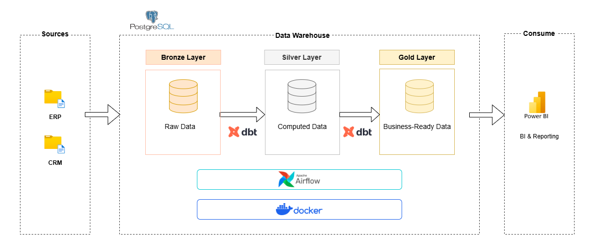
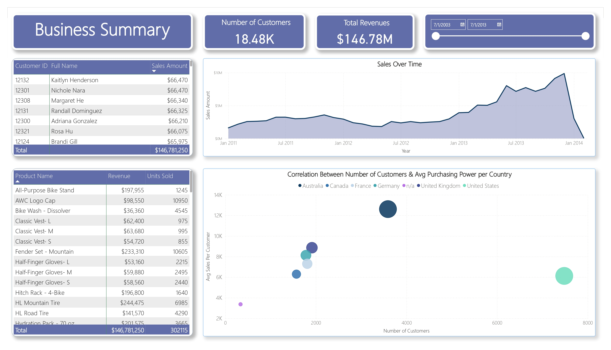
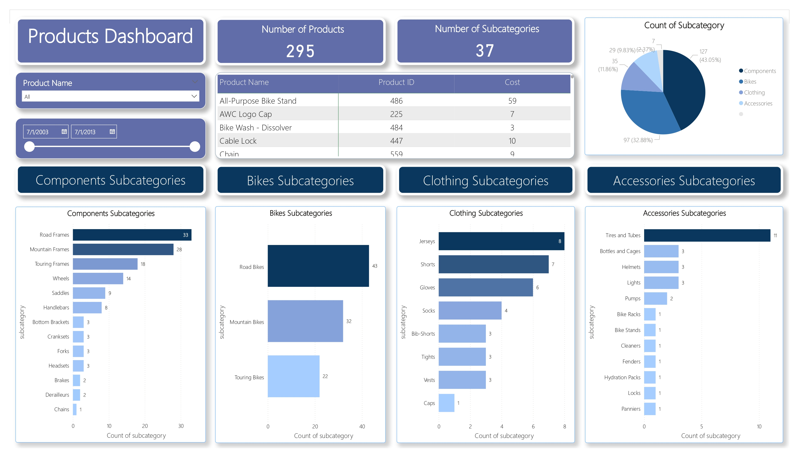

# ETL-engine



## 📑 Table of Contents

- [ETL-engine](#etl-engine)  
  - [Introduction](#introduction)
  - [Technologies Used And Tools](#technologies-used-and-tools)
  - [Pipeline Architecture](#pipeline-architecture)
  - [Docker Setup](#docker-setup)
    - [Custom Dockerfile](#custom-dockerfile)
  - [DAG Overview](#dag-overview)
    - [DAG Overview: sales_pipeline](#dag-overview-sales_pipeline)
  - [DBT Models Transformation](#dbt-models-transformation)
    - [Silver Layer (Cleaned & Structured Data)](#silver-layer-cleaned--structured-data)
    - [Gold Layer (Analytics-ready Models)](#gold-layer-analytics-ready-models)
      - [Fact Tables](#fact-tables)
      - [Dimensions](#dimensions)
  - [Data Catalog](#data-catalog)
    - [Overview](#overview)
    - [Bronze Layer](#bronze-layer)
    - [Silver Layer](#silver-layer)    
    - [Gold Layer](#gold-layer)      
  - [Data Warehouse Schema](#data-warehouse-schema) 
  - [Data Lineage](#data-lineage)
  - [Reporting](#reporting)  

---

## Introduction

This project utilizes data from two different sources (**CRM** and **ERP**), which provide detailed datasets about sales transactions, including customer information, products, locations, and more.  

These datasets are transformed and stored in a **Data Warehouse** using the **Medallion architecture** to structure the data efficiently for analytics.  

I applied **DBT (Data Build Tool)** in the ETL pipeline to transform raw data into analytics-ready datasets, ensuring high-quality and optimized data models for reporting and business intelligence.

---

## Technologies Used And Tools

- **Docker**: To containerize and standardize the development environment.  
- **Python**: For scripting tasks and automating data processes.  
- **PostgreSQL**: Acted as the data warehouse.
- **pgAdmin**: A graphical user interface to interact with the PostgreSQL database, inspect data, validate transformations, and execute SQL queries during development and testing.
- **Airflow**: Managed and scheduled ETL workflows.  
- **DBT (Data Build Tool)**: Handled the transformation and building of data models within the warehouse.  
- **Power BI**: Delivered the final insights through interactive dashboards and visual reports.  

---

## Pipeline Architecture


---

## Docker Setup 
To ensure consistency, reusability, and easy environment setup across all tools used in this project, I utilized Docker and Docker Compose to build a fully integrated ETL development environment.

### Custom Dockerfile
A custom Docker image `engine-airflow-custom:latest` was created based on apache/airflow:2.10.4 to include all necessary libraries used in the ETL pipeline and DBT transformations:

```dockerfile
FROM apache/airflow:2.10.4

USER airflow

RUN pip install --no-cache-dir \
    pandas \
    dbt-core \
    dbt-postgres \
    airflow-dbt-python \
    psycopg2-binary \ 
    flake8    

USER root
RUN apt-get update && apt-get install -y git
```


> 📁 For detailed settings and the full configuration for `volumes`, `Networks`, and the working tools, please refer to the `docker-compose.yml` file in the repository here: [docker compose file](airflow/docker-compose.yml)

---

## DAG Overview

The ETL pipeline is orchestrated by Apache Airflow using the TaskFlow API and Bash Operators, with a focus on modular ingestion, transformation, and testing for CRM and ERP data sources.


### DAG Overview: sales_pipeline
This DAG is responsible for extracting, transforming, and loading sales-related data into a PostgreSQL database, then applying DBT models to transform the data into clean dimensional layers.
See More: [Pipeline.py](airflow/dags/pipeline.py)

## DBT Models Transformation

The transformation layer of this ETL pipeline is implemented using **DBT (Data Build Tool)** to structure and optimize raw data for analytics and reporting purposes. The transformation process follows a layered approach using the **Medallion Architecture**, specifically focusing on the **Silver** and **Gold** layers.

### Silver Layer (Cleaned & Structured Data)

In the **Silver layer**, raw data from the **Bronze layer** (which consists of six tables sourced from CRM and ERP systems) is cleaned, standardized, and structured.

**Bronze Layer Tables:**
- `crm_cust_info`
- `crm_prd_info`  
- `crm_sales_details`
- `erp_cust_az12`
- `erp_loc_a101`
- `erp_px_cat_g1v2`       

**Transformed into Silver Layer Tables:**
- `crm_cust_info` *(retained with cleaning and standardization)*

```sql
{{ 
    config(        
        materialized='table',
        unique_key='ID',
        indexes=[{"columns": ['ID'], "unique": true}],
    ) 
}}


with customer_info as (
    SELECT 
        *, 
        row_number() OVER (PARTITION BY cst_id ORDER BY cst_create_date DESC) AS last_update
    FROM {{ source('raw_data', 'crm_cust_info') }}
)

SELECT 
    cst_id AS ID,
    cst_key AS customer_key,
    TRIM(cst_firstname) as firstname,
    TRIM(cst_lastname) as lastname,
    CASE 
        WHEN UPPER(TRIM(cst_marital_status)) = 'S' THEN 'Single' 
        WHEN UPPER(TRIM(cst_marital_status)) = 'M' THEN 'Married' 
        ELSE  'N/A'
    END AS marital_status,
    CASE 
        WHEN UPPER(TRIM(cst_gndr)) = 'F' THEN 'Female' 
        WHEN UPPER(TRIM(cst_gndr)) = 'M' THEN 'Male' 
        ELSE  'N/A'
    END AS gender,
    cst_create_date
FROM customer_info
WHERE last_update = 1 and cst_id is not null
```

- `crm_prd_info` *(retained with cleaning and standardization)*

```sql
{{
    config(
        materialized='table',
        unique_key='product_id',
        indexes=[{"columns": ['product_id'], "unique": true}]
    )
}}

with products_info as (
    SELECT 
        *, 
        row_number() OVER (PARTITION BY prd_id ORDER BY prd_start_dt DESC) AS last_update        
    FROM {{ source('raw_data', 'crm_prd_info') }}
)

SELECT 
    prd_id AS product_id,
    REPLACE(SUBSTRING(prd_key, 1, 5), '-', '_') AS category_id,
    SUBSTRING(prd_key, 7, LENGTH(prd_key)) AS prd_key_id,
    prd_nm AS product_name, 
    COALESCE(prd_cost, 0) AS product_cost, 
    CASE 
        WHEN UPPER(TRIM(prd_line)) = 'M' THEN  'Mountain'
        WHEN UPPER(TRIM(prd_line)) = 'R' THEN  'Road'
        WHEN UPPER(TRIM(prd_line)) = 'T' THEN  'Touring'
        WHEN UPPER(TRIM(prd_line)) = 'S' THEN  'Other Sales'
        ELSE  'N/A'
    END AS product_line,
    CAST(prd_start_dt AS DATE) AS start_date,
    CAST(LEAD(prd_start_dt) OVER (PARTITION BY prd_key ORDER BY prd_start_dt) - INTERVAL '1 DAY' AS DATE) AS end_date
FROM products_info
WHERE last_update = 1 and prd_id is not null
```

These models act as structured, reliable datasets for dimensional modeling. [See More](airflow/dbt/sales/models/silver_layer)

### Gold Layer (Analytics-ready Models)

In the **Gold layer**, I built analytical models in the form of **fact** and **dimension** tables:

#### Fact Tables

- `fact_sales`:

```sql
WITH fact_sales AS(
    SELECT        
        sls.order_number,
        prd.product_key,        
        cust.customer_key,
        od.date_key AS key_order_date,
        sd.date_key AS key_ship_date,
        dd.date_key AS key_due_date,
        sls.sales_amount,
        sls.quantity,
        sls.unit_price

    FROM {{ref('crm_sales_details')}} AS sls    
    LEFT JOIN {{ref('dim_customers')}} AS cust   
        ON sls.customer_id = cust.customer_id
    LEFT JOIN {{ref('dim_products')}} AS prd   
        ON sls.product_key = prd.product_number    
    LEFT JOIN {{ref('dim_dates')}} AS od
        ON sls.order_date = od.date_value 
    LEFT JOIN {{ref('dim_dates')}} AS sd
        ON sls.ship_date = sd.date_value 
    LEFT JOIN {{ref('dim_dates')}} AS dd
        ON sls.due_date = dd.date_value 
)

SELECT * FROM fact_sales
```

#### Dimensions
- `dim_products`:

```sql
WITH customer_info AS (
    SELECT         
        crm_cust.ID as customer_id,
        crm_cust.customer_key,
        crm_cust.firstname AS first_name,
        crm_cust.lastname AS last_name,
        CASE WHEN crm_cust.gender != 'N/A' THEN crm_cust.gender
            ELSE COALESCE(erp_cust.gender, 'N/A')
        END AS gender,
        crm_cust.marital_status,
        erp_cust.bdate AS birth_date,        
        erp_loc.cntry AS country
    FROM {{ref('crm_cust_info')}} AS crm_cust
    LEFT JOIN {{ref('erp_customer_info')}} AS erp_cust
    ON crm_cust.customer_key = erp_cust.cid
    LEFT JOIN {{ref('erp_customer_locations')}} AS erp_loc
    ON crm_cust.customer_key = erp_loc.cid
)

SELECT *
FROM customer_info
```

- `dim_dates`:

```sql
WITH dates AS (
    SELECT order_date AS ord_date_value FROM{{ref('crm_sales_details')}}
    UNION 
    SELECT ship_date FROM {{ref('crm_sales_details')}}
    UNION 
    SELECT due_date FROM{{ref('crm_sales_details')}}
),
date_dim_cte AS (
    SELECT  
        DISTINCT ord_date_value AS date_value,
        MD5(CAST(ord_date_value AS TEXT)) AS date_key,
        EXTRACT(YEAR FROM ord_date_value) AS year,
        EXTRACT(MONTH FROM ord_date_value) AS month,
        EXTRACT(DAY FROM ord_date_value) AS day,
        EXTRACT(QUARTER FROM ord_date_value) AS quarter,
        TO_CHAR(ord_date_value, 'FMDay') AS day_name,
        TO_CHAR(ord_date_value, 'FMMonth') AS month_name
    FROM dates    
)

SELECT
    * 
FROM date_dim_cte
WHERE date_value IS NOT NULL OR date_key IS NOT NULL
```

> This layered approach ensures clean separation of concerns, maintainability, and performance optimization in analytics workflows. [See More](airflow/dbt/sales/models/gold_layer)

---

## Data Catalog

### Overview

The **Data Catalog** serves as a centralized document that documents all datasets processed within the ETL engine. It provides metadata for every table across the three standardized layers of the Medallion Architecture: **`Bronze`**,**`Silver`**, and **`Gold`**.

- **Bronze Layer**: Raw, ingested data from `CRM` and `ERP` systems. It contains semi-structured or unprocessed records as they arrive from source systems, offering full data traceability and recovery capabilities.
- **Silver Layer**: Cleaned and transformed datasets. Here, data is deduplicated, typed, and structured for analytical readiness, providing business-friendly formats.
- **Gold Layer**: Business-level aggregated models. This includes fact and dimension tables that are optimized for dashboards, reporting, and downstream analytics.

### Bronze Layer

The **Bronze Layer** is the raw data layer. It stores data exactly as received from the source systems (like CRM or ERP) with minimal to no transformation. It contains:

#### ` crm_cust_info `
- **Description**: CRM Customer Raw Data
- **Refresh Rate**: Full Load
- **Source**: `CRM System`
- **Columns**:

| Column Name        | Data Type            | Description                                      |
|--------------------|----------------------|--------------------------------------------------|
| `cst_id`           | `integer`            | Unique numeric identifier for each customer.     |
| `cst_key`          | `varchar(50)`        | Business key or external identifier for the customer. |
| `cst_firstname`    | `varchar(50)`        | Customer's first name.                          |
| `cst_lastname`     | `varchar(50)`        | Customer's last name.                           |
| `cst_marital_status` | `varchar(50)`      | Marital status (e.g., 'S' for Single, 'M' for Married). |
| `cst_gndr`         | `varchar(50)`        | Gender of the customer (e.g., 'M', 'F').        |
| `cst_create_date`  | `date`               | The date the customer record was created.       |

#### `erp_cust_az12`
- **Description**: ERP Customer Raw Data
- **Refresh Rate**: Full Load
- **Source**: `ERP System`
- **Columns**:

| Column Name | Data Type         | Description                                              |
|-------------|-------------------|----------------------------------------------------------|
| `cid`       | `varchar(50)`     | Unique customer code.    |
| `bdate`     | `date`            | Customer's date of birth.                               |
| `gen`       | `varchar(12)`     | Customer's gender.              |

### Silver Layer

The **Silver Layer** represents the cleaned and refined version of the raw data collected in the Bronze Layer. At this stage, data is transformed to fix issues such as duplicates, null values, and inconsistent formats. It may also include standardized fields, derived columns, and basic joins between related datasets to create a more structured and consistent sets of the data. It contains:

#### `crm_sales_details`
- **Description**: Cleaned, standardized, and formatted sales order from the bronze layer
- **Refresh Rate**: daily
- **Source**: `bronze.crm_sales_details`
- **Columns**:

| Column Name     | Data Type              | Description                                                                 |
|-----------------|------------------------|-----------------------------------------------------------------------------|
| `order_number`  | `character varying(50)`| Unique identifier for the sales order.                                      |
| `product_key`   | `character varying(50)`| Code representing the specific product sold.                                |
| `customer_id`   | `integer`              | ID of the customer who placed the order.                                    |
| `sls_sales`     | `double precision`     | Sales value generated from the order (may duplicate `sales_amount`).        |
| `order_date`    | `date`                 | Date when the order was placed.                                             |
| `ship_date`     | `date`                 | Date when the order was shipped.                                            |
| `due_date`      | `date`                 | Expected delivery date of the order.                                        |
| `sales_amount`  | `double precision`     | Total amount of the order (usually = unit price × quantity).                |
| `quantity`      | `integer`              | Number of product units sold in the order.                                  |
| `unit_price`    | `double precision`     | Price per unit of the product.                                              |

### Gold Layer

#### `dim_products`
- **Description**:
This dimension extracts and enriches product information from the CRM system, joining it with additional category data from the ERP system. Only active (non-expired) products are included. A surrogate key (`product_key`) is generated using `ROW_NUMBER()` to uniquely identify each product record in an ordered fashion.
- **Source**:
  - The source table `crm_prd_info` is filtered to include only records where `end_date IS NULL` (active products).
  - It is joined with `erp_px_cat` to enhance each product with its full category and subcategory names, along with maintenance information.
  - A surrogate `product_key` is generated using `ROW_NUMBER()` based on the start date and original product key ID.
- **Schema**:

| Column Name     | Data Type         | Description                                                                 |
|-----------------|-------------------|-----------------------------------------------------------------------------|
| `product_key`   | `bigint`         | Surrogate key generated via `ROW_NUMBER()` for uniquely identifying rows.  |
| `product_id`    | `int`  | Original product ID from the CRM system.                                    |
| `product_number`| `text` | Original key identifier for the product from CRM.                         |
| `product_name`  | `varchar(50)`         | Name of the product.                                                        |
| `category_id`   | `text`  | Foreign key referring to the category from ERP.                             |
| `category`      | `varchar(50)`         | Category name from ERP table.                                               |
| `subcategory`   | `varchar(50)`         | Subcategory name from ERP table.                                            |
| `product_line`  | `text`         | Product line classification.                                                |
| `cost`          | `double` | Cost of the product.                                               |
| `start_date`    | `date`            | Start date of the product's lifecycle.                                      |
| `maintenance`   | `varchar(10)`| Indicates if the product requires maintenance (from ERP).                  |

> 📁 This catalog acts as documentation to investigate all the layers, tables, and the relations between each one and the attributes of each table. The full `Data Catalog` file can be found: [Here](Docs/data-catalog.md).

---

## Data Warehouse Schema


## Data Lineage


## Reporting

### Sales Dashboard Report (2010-2014)
Overview: The ETL pipeline dashboard summarizes sales performance from 2010 to 2014, with total revenue of $146.78M from 18.84K customers (avg. $7.94K/customer).
  -	Top Markets: Australia ($45.3M) and the UK ($16.96M) show strong purchasing power, and reflecting high customer purchasing power.
  -	U.S. Performance: U.S. sales reached $45.81M, but average customer spend is lower, indicating weaker purchasing power.
  -	Demographics: The 30-34 age group is the largest segment (17.5%), driving significant sales.
  -	Categories: Components lead sales, while clothing accessories lag, indicating underperformance.

For more insights and key findings from the 2010-2014 sales dashboard, please refer to [Sales Report](Reporting-Layer)







If you have any questions or need clarification on anything in the project, feel free to reach out! I'd be more than happy to help and would love to assist you with any queries.

## 📱 Contact Me
Feel free to reach out if you have any questions or if you'd like to connect!

📧 Email: mohamed.nasr.moh@gmail.com

🔗 LinkedIn: [Mohamed Nasr](https://www.linkedin.com/in/de-mohamed-nasr/)
