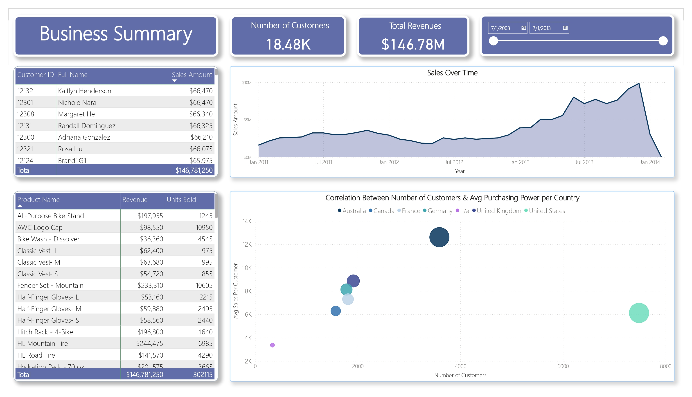
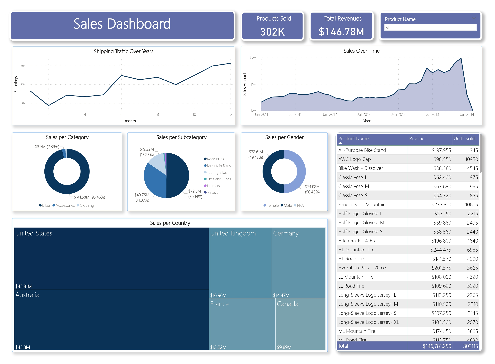
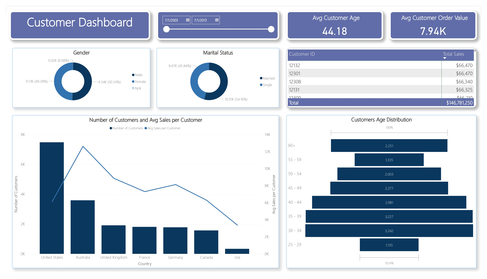
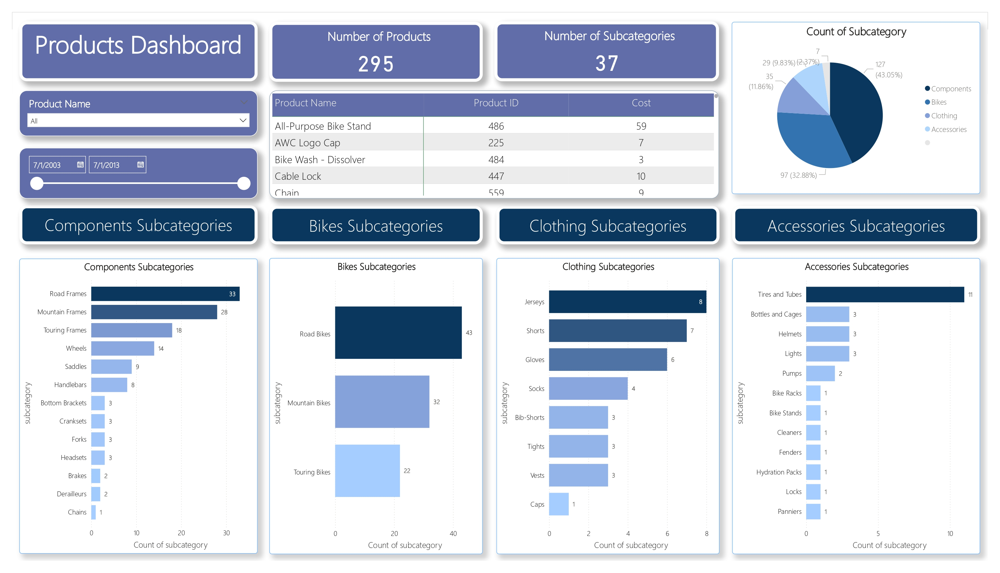

## Sales Dashboard Report (2010-2014)

Overview: The ETL pipeline dashboard summarizes sales performance from 2010 to 2014, with total revenue of $146.78M from 18.84K customers (avg. $7.94K/customer).

  - Top Markets: Australia ($45.3M) and the UK ($16.96M) show strong purchasing power, reflecting high per-customer spending.
  - U.S. Performance: U.S. sales reached $45.81M, but average customer spend is lower, indicating weaker purchasing power.
  - Demographics: The 30-34 age group is the largest segment (17.5%), driving significant sales.
  - Categories: Components lead sales, while clothing accessories lag, indicating underperformance.

Conclusion: Focus marketing on the 25-34 demographic and boost clothing accessory sales to enhance revenue, particularly in the U.S., to strengthen purchasing power.

---

## Dashboards

### Business Summary

### Sales Dashboard

### Customers Dashboard

### Products Dashboard

